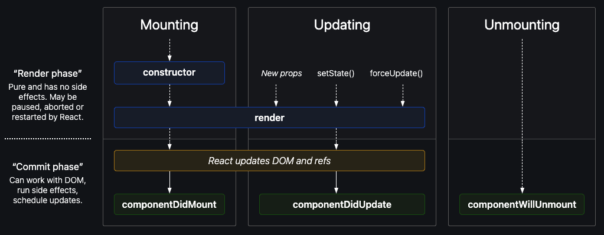

Please have these 3 repos open during the next React sections. If you ever get stuck, you can look at my code for these 3 versions:

Robofriends (React v18 & Create React App) - this is the one we will use at the beginning.
https://github.com/aneagoie/robofriends/blob/master/src/containers/App.js

Robofriends (React v19+ & Vite) - this is the one you will have at the end of the section.
https://github.com/aneagoie/robofriends-latest/blob/main/src/containers/App.jsx

Robofriends (React Hooks) - this is the one you will have at the end of React Hooks section.
https://github.com/aneagoie/robofriends-hooks/blob/master/src/containers/App.js

LifeCycle methods:
https://projects.wojtekmaj.pl/react-lifecycle-methods-diagram/

Mounting:  these methods are called when an instance of a component is being created and inserted into the DOM:
1) constructor()
2) componentWillMount()
3) render()
4) ComponentDidMount()

Updating: An update can be caused by changes to props or state.  These methods are called when a component is being re-rendered.
1) componentWillReceiveProps()
2) shouldComponentUpdate()
3) componentWillUpdate()
4) render()
5) componentDidUpdate()

